# SurakshaVault – Unlock Trust, Not Your Data

Welcome to **SurakshaVault**, a privacy-first data-sharing framework built to transform how fintechs handle, share, and govern sensitive user information. Designed by **Team Codeblooded** for **Canara Bank Hackathon Suraksha 2025**, SurakshaVault turns compliance and transparency into a competitive edge.

## 📋 Table of Contents

- [🎯 Introduction](#-introduction)
- [🚨 Problem Statement](#-problem-statement)
- [💡 Solution](#-solution)
- [✨ Key Features](#-key-features)
- [📸 Screenshots](#-screenshots)
- [🛠️ Technology Stack](#️-technology-stack)
- [👥 Team Members](#-team-members)
- [🚀 Future Enhancements](#-future-enhancements)
- [⚙️ Installation](#️-installation)
- [📖 Usage](#-usage)
- [🤝 Contributing](#-contributing)

---

## 🎯 Introduction

SurakshaVault introduces a **Trust-as-a-Service** model for responsible data sharing across fintech ecosystems. In an era where data is vulnerable the moment it leaves your platform, our system ensures control, compliance, and clarity travel *with* the data—wherever it goes.

---

## 🚨 Problem Statement

Fintechs face a growing challenge:

- **Data Vulnerability**: Sensitive data is frequently shared (banking, PII, income, behavioral data)
- **Limited Control**: APIs provide little post-sharing control or visibility
- **User Concerns**: Users fear data misuse, fraud, and unauthorized access
- **Regulatory Pressure**: GDPR, India's DPDP demands privacy-by-design, consent enforcement, and auditability
- **Expanded Attack Surface**: Integrations with third parties (Open Banking) increase security risks

---

## 💡 Solution

SurakshaVault offers a comprehensive data governance solution:

- 🔒 **Granular, pseudonymized data sharing** via encrypted tokens
- 🤖 **AI-driven fraud detection** and behavior validation
- ⛓️ **Immutable blockchain audit trails**
- 📊 **User dashboards** for complete visibility and consent management
- 📋 **Regulation-ready compliance engine** for GDPR and DPDP Act

Our mission is to make data "smart"—self-governing, purpose-bound, and auditable beyond platform boundaries.

---

## ✨ Key Features

### 🔐 Post-Sharing Data Control
- Data is tokenized and decrypted only on verified clients
- Purpose-limited access that auto-expires
- Useless if APIs are leaked—no raw PII shared

### ⚖️ Built-In Compliance
- Lifecycle-based consent management (grant, revoke, auto-expiry)
- Full support for "Right to be Forgotten"
- Least privilege sharing by default

### 🧠 Proactive AI Security
- Local fraud detection using IP, geo, and behavior patterns
- Smart access validation using AI before data is delivered

### 📊 Radical Transparency
- Blockchain-powered audit logs
- Real-time user access logs & consent history
- Admin command center for full visibility

### 🔗 One Platform, Many Defenses
- 3-tier access model: Admin, Partner, User
- Verified onboarding (CIN/DIN based)
- Frontend-only decryption in zero-trust architecture (Pseudonymization)

---

## 📸 Screenshots

### 🔐 Access Portal
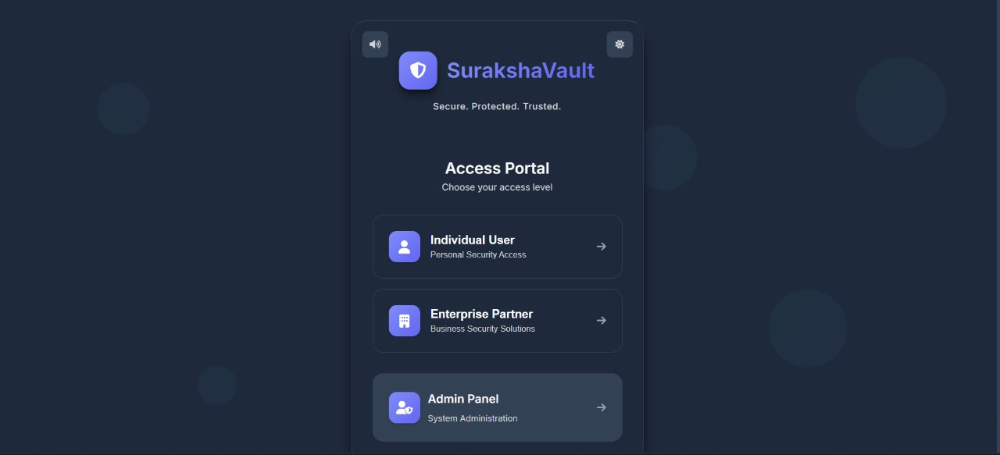

### 🛠️ Admin Dashboard
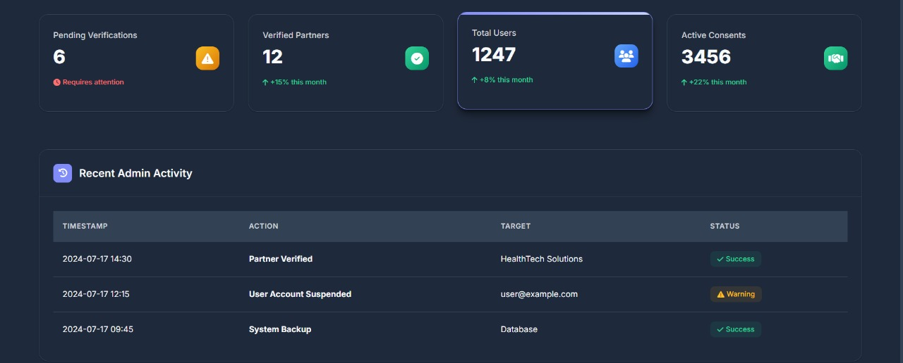

### 🔑 Admin Login
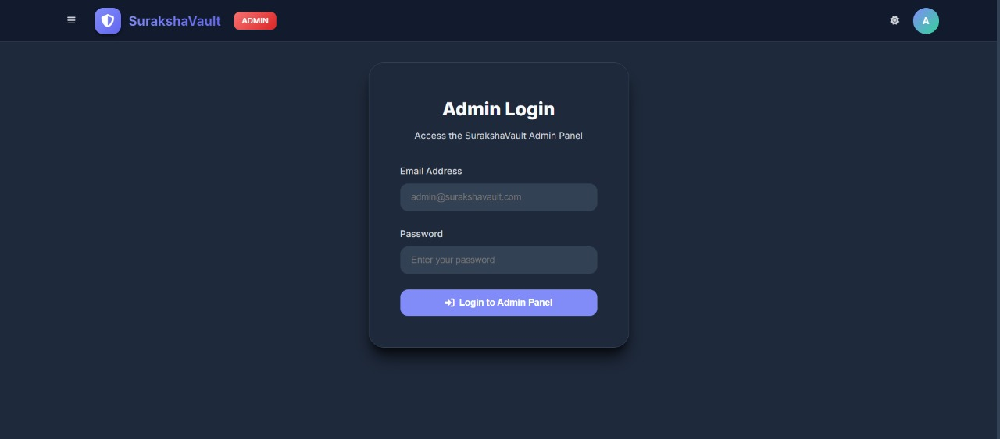

### 🔗 Connected Apps
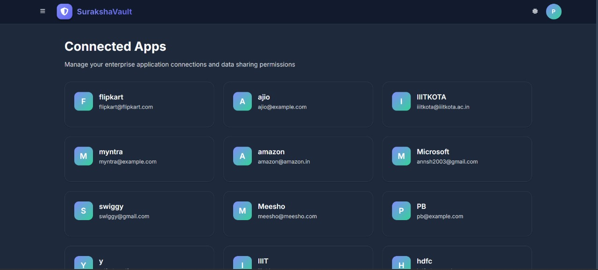

### 📊 Consent Analysis
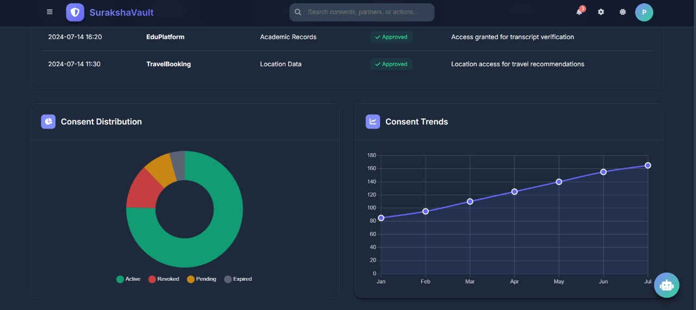

### ✅ Consents
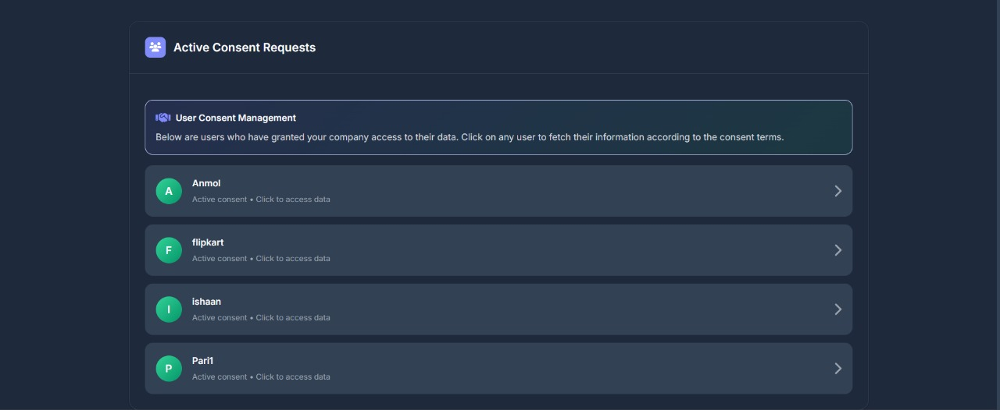

### 🖥️ Landing Page


### 👤 Partner Login
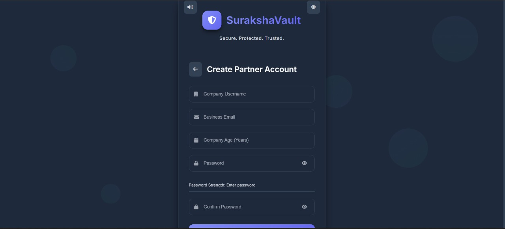

### 🧾 Partner Profile
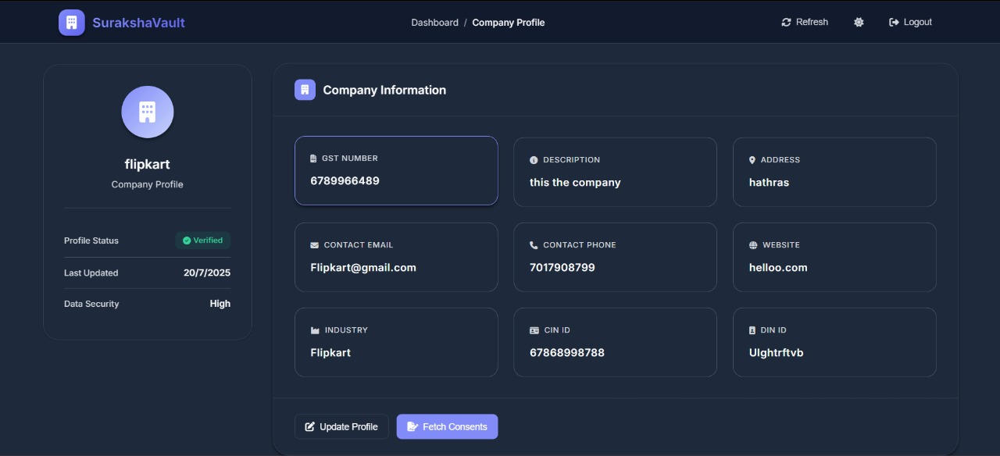

### 🕵️‍♂️ Partner Verify Queue
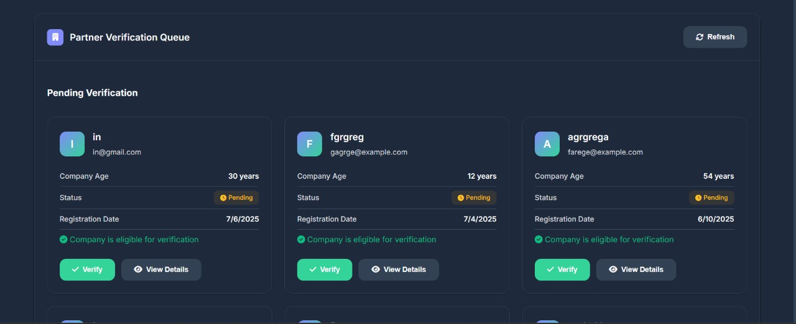

### 💳 User Card Details
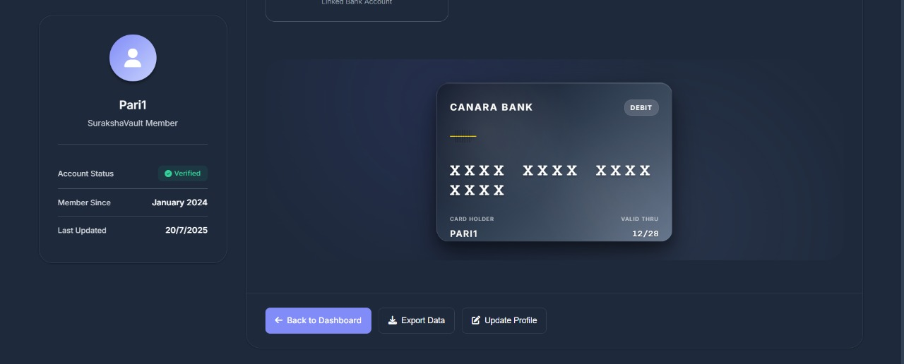

### 📋 User Dashboard


### 🔐 User Login
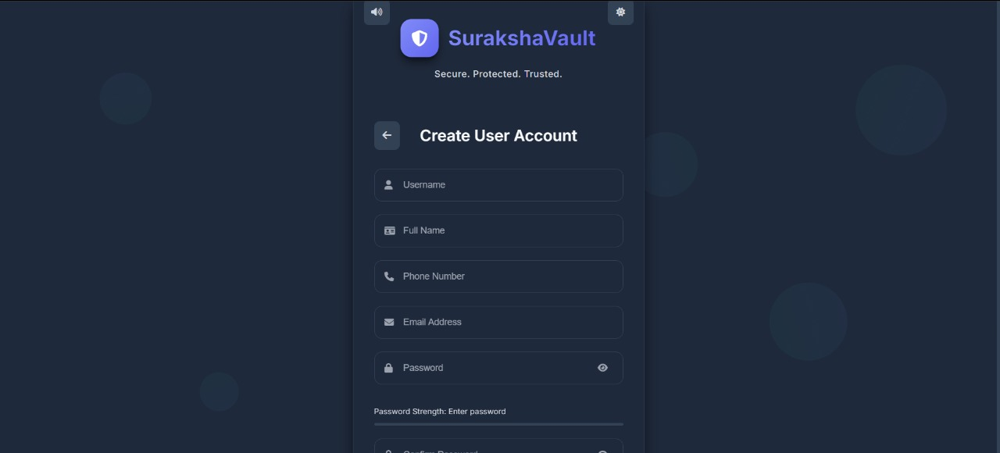

### 👤 User Profile
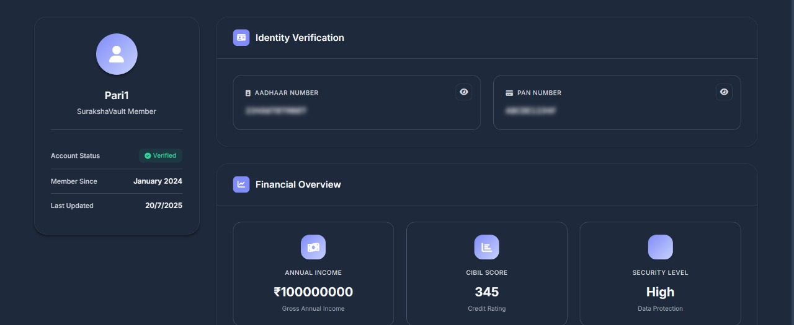

### Consent Dashboard & Audit Trail
*User interface showing active consents, revoke button, and access history*

### Partner Verification Flow
*Admin dashboard for verifying partners and monitoring requests*

### Smart Token Access System
*Encrypted token generation and frontend-only data decryption*

> **Note**: Screenshots can be added by uploading images into the `assets/` directory and linking them here.

---

## 🛠️ Technology Stack

| Component            | Technology                            |
|----------------------|----------------------------------------|
| **Frontend Decryption**  | AES-256 + JWT                          |
| **AI Engine**            | Scikit-learn / TensorFlow.js (local)   |
| **Blockchain Logging**   | HardHat / Solidity-based chain         |
| **Backend Services**     | Spring MVC & Spring Boot               |
| **Infrastructure**       | Docker, Cron Jobs, AWS (scalable)      |
| **Compliance Engine**    | Custom APIs for consent & data deletion|
| **Database**             | Firebase / PostgreSQL (flexible)          |

---

## 👥 Team Members

Built with passion by **Team Codeblooded**:

- **Anmol Upadhyay**
- **Harshita Yadav**
- **Ishan Bagra**
- **Jai Taneja**
- **Sahil Agarwal**

---

## 🚀 Future Enhancements

- [ ] Cross-border data sharing with jurisdictional rules
- [ ] Partner scoring & automated reputation system
- [ ] Enhanced fraud prediction using ML ensemble models
- [ ] Public blockchain logging integration
- [ ] UI analytics to improve consent interaction design
- [ ] Multi-language support for global compliance
- [ ] Advanced encryption with quantum-resistant algorithms

---

## ⚙️ Installation

### Prerequisites

- Java 17 (or Higher)
- Maven 3.6+ (or Gradle 7+)
- Git

### Steps

1. **Clone the repository:**
   ```bash
   git clone https://github.com/your-org/SurakshaVault.git
   ```

2. **Navigate into the project:**
   ```bash
   cd SurakshaVault
   ```

3. **Configure the project**
   ```bash
   cp src/main/resources/application.properties.example src/main/resources/application.properties
   ```

4. **Build The Project**
   ```bash
   mvn clean install
   ```

5. **Run The Application:**
   ```bash
   mvn spring-boot:run
   ```

6. **Access the application:**
   - Open your browser and navigate to `http://localhost:8080`

---

## 📖 Usage

### Getting Started

1. **Access the application** at `http://localhost:8080`

2. **Use mock credentials** for different user roles:
   - **Admin**: Full system access and partner verification
   - **Partner**: API access for data requests
   - **User**: Consent management and audit viewing

3. **Test core functionalities:**
   - **User Dashboard**: Manage consent and view audit logs
   - **Admin Panel**: Verify partners and monitor system activity
   - **Partner Portal**: Request tokenized data access


## 🤝 Contributing

We welcome contributions! Please see our [Contributing Guidelines](CONTRIBUTING.md) for details.

### Development Workflow

1. Fork the repository
2. Create your feature branch (`git checkout -b feature/AmazingFeature`)
3. Commit your changes (`git commit -m 'Add some AmazingFeature'`)
4. Push to the branch (`git push origin feature/AmazingFeature`)
5. Open a Pull Request

---


---

## 🆘 Support

If you encounter any issues or have questions:

- 📧 Email: support@surakshaVault.com
- 🐛 Issues: [GitHub Issues](https://github.com/your-org/SurakshaVault/issues)
- 📖 Documentation: [Wiki](https://github.com/your-org/SurakshaVault/wiki)

---

<div align="center">
  <strong>Built with ❤️ by Team Codeblooded</strong>
  <br>
  <em>Empowering secure data sharing in the fintech ecosystem</em>
</div>
